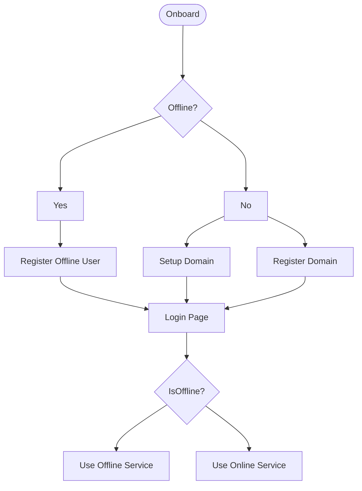
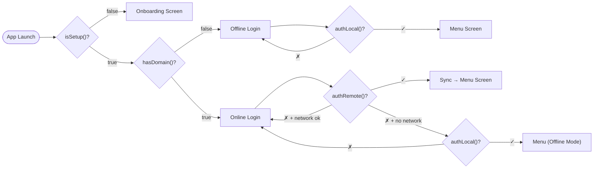
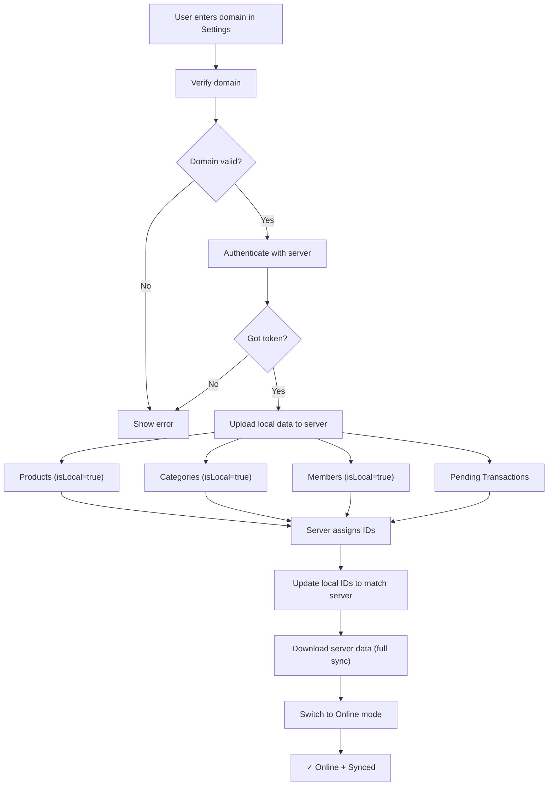

# Offline-First Support Plan for Lakasir

This document outlines the **offline-first** architecture for the Lakasir Flutter POS application. The system is designed so that every feature works locally first, with the server as an optional enhancement — not a requirement. Cashiers can onboard, register, and process transactions entirely without network connectivity.

## Table of Contents

- [Overview](#overview)
- [Offline-First Flow](#offline-first-flow)
- [Architecture](#architecture)
- [Offline User Model](#offline-user-model)
- [Isar Models](#isar-models)
- [Service Layer — Dual-Mode Design](#service-layer--dual-mode-design)
- [Sync Strategy](#sync-strategy)
- [Implementation Phases](#implementation-phases)
- [Code Examples](#code-examples)
- [Testing Checklist](#testing-checklist)
- [Migration Guide](#migration-guide)

---

## Overview

### Core Principle

> **Offline First** means the app's default mode is offline. The local Isar database is the single source of truth. The server is an optional sync target that provides cloud backup, multi-device access, and collaborative features — but the app is fully functional without it.

### Goals
- Enable cashiers to **onboard without network** (register as an offline user)
- Process transactions completely offline from day one
- Cache product catalog, members, and payment methods for offline access
- Queue transactions for sync when connectivity returns
- Maintain data consistency between device and server
- Seamlessly upgrade from offline-only to online+sync when a domain is configured

### Current State
- Database: Isar (only used for Printer & Unit)
- State Management: GetX
- API: RESTful services
- Auth flow: Onboard → Register/Setup Domain → Login → Menu
- **No offline mechanism exists today**

### Dependencies to Add
```yaml
dependencies:
  connectivity_plus: ^6.0.0  # Network state detection
  workmanager: ^0.5.2        # Background sync
  crypto: ^3.0.3             # SHA-256 for offline password hashing
```

---

## Offline-First Flow

### Top-Level User Journey



### Flow Explanation

| Step | Screen | Description |
|------|--------|-------------|
| **Onboard** | `OnboardingScreen` | Existing onboarding pages (welcome slides) |
| **Offline?** | Decision | Check if device has network **or** if user chose offline mode |
| **Register Offline User** | `RegisterOfflineUserScreen` ⭐ NEW | Create a local user account stored in Isar — no server call |
| **Register Domain** | `RegisterDomainScreen` | Existing: create a new lakasir.com subdomain |
| **Setup Domain** | `SetupScreen` | Existing: connect to an already-registered domain |
| **Login Page** | `LoginScreen` | Unified login — works for both offline and online users |
| **IsOffline?** | Runtime check | After login, determine which service layer to use |
| **Use Offline Service** | — | All CRUD goes through Isar; sync queue holds outbound changes |
| **Use Online Service** | — | All CRUD goes through API + Isar cache; real-time sync |

### Authentication Decision Tree



### Mode Switching

A user who starts offline can **upgrade to online** at any time by navigating to Settings → "Connect to Server" → entering their domain. This triggers:

1. Domain verification (same as `SetupScreen`)
2. First-time sync: upload all local data to the server
3. Switch from `OfflineService` to `OnlineService`
4. Enable periodic background sync

A user who is online can **continue offline** if network drops. The `ConnectivityService` detects this and transparently switches service implementations.

---

## Architecture

### Layer Diagram

```
┌─────────────────────────────────────────────────────────┐
│                     UI / GetX Controllers                │
│  (Unaware of online/offline — calls Repository only)    │
└────────────────────────┬────────────────────────────────┘
                         │
                         ▼
┌─────────────────────────────────────────────────────────┐
│                  Repository Layer                        │
│  (Routes to Offline or Online service based on mode)     │
│                                                         │
│   ┌──────────────┐          ┌──────────────┐             │
│   │ OfflineService│          │ OnlineService│             │
│   │  (Isar CRUD) │          │ (API + Cache)│             │
│   └──────┬───────┘          └──────┬───────┘             │
│          │                         │                     │
│          ▼                         ▼                     │
│   ┌──────────────────────────────────────┐              │
│   │         Isar Database (Local)         │              │
│   │     ★ Single source of truth ★       │              │
│   └──────────────────────────────────────┘              │
│                          │                               │
│                          ▼                               │
│                ┌──────────────────┐                      │
│                │   Sync Queue     │                      │
│                │ (Outbound Txns) │                      │
│                └──────────────────┘                      │
└─────────────────────────────────────────────────────────┘
                         │ (when online)
                         ▼
                ┌──────────────────┐
                │   REST API Server │
                └──────────────────┘
```

### Key Architectural Rules

1. **Isar is the source of truth** — Every read/write hits Isar first, even in online mode.
2. **Controllers never call API services directly** — They always go through the Repository.
3. **Repository picks the service** — Based on `AppMode` (offline/online), the repo delegates to the correct service implementation.
4. **Offline user = first-class user** — The `OfflineUser` model stores credentials locally with hashed passwords.
5. **Sync is additive** — Going online never deletes local data; it merges and syncs.

### App Mode Management

```dart
enum AppMode { offline, online }

class AppModeService extends GetxController {
  static AppModeService get to => Get.find();

  Rx<AppMode> mode = AppMode.offline.obs;

  bool get isOffline => mode.value == AppMode.offline;
  bool get isOnline => mode.value == AppMode.online;

  /// Called after login to determine mode
  Future<void> determineMode() async {
    final hasDomain = await _hasDomain();
    if (!hasDomain) {
      mode.value = AppMode.offline;
      return;
    }
    // Has domain — try online, fall back to offline
    final hasNetwork = await ConnectivityService.to.checkConnection();
    mode.value = hasNetwork ? AppMode.online : AppMode.offline;
  }

  /// Called when user connects to a server from settings
  Future<void> switchToOnline(String domain) async {
    await storeSetup(domain);
    mode.value = AppMode.online;
    await SyncService.to.fullSync();
  }

  /// Called when network drops
  void switchToOffline() {
    mode.value = AppMode.offline;
  }

  /// Called when network returns
  void switchToOnline() {
    mode.value = AppMode.online;
    SyncService.to.attemptSync();
  }

  Future<bool> _hasDomain() async {
    final setup = await isSetup();
    if (!setup) return false;
    final domain = await getDomain();
    return domain.isNotEmpty;
  }
}
```

---

## Offline User Model

This is the foundational addition that makes "offline first" possible. An offline user is stored entirely in Isar with a SHA-256 hashed password.

### Isar Model

```dart
// lib/offline/models/offline_user_model.dart
import 'package:isar/isar.dart';
import 'package:crypto/crypto.dart';
import 'dart:convert';

part 'offline_user_model.g.dart';

@collection
class OfflineUser {
  Id id = Isar.autoIncrement;

  String name;
  String email;
  String hashedPassword; // SHA-256 salted
  String salt;
  String? shopName;
  String? businessType;
  String? domain;      // null until connected to server
  bool isOfflineUser;  // true = registered locally, false = synced from server
  DateTime createdAt;
  DateTime? lastSyncAt;

  OfflineUser({
    required this.name,
    required this.email,
    required this.hashedPassword,
    required this.salt,
    this.shopName,
    this.businessType,
    this.domain,
    this.isOfflineUser = true,
    DateTime? createdAt,
    this.lastSyncAt,
  }) : createdAt = createdAt ?? DateTime.now();

  /// Hash a password with salt using SHA-256
  static String hashPassword(String password, String salt) {
    final bytes = utf8.encode('$password$salt');
    return sha256.convert(bytes).toString();
  }

  /// Generate a random salt
  static String generateSalt() {
    return DateTime.now().microsecondsSinceEpoch.toString() +
        Random().nextInt(999999).toString();
  }

  /// Verify a password against stored hash
  bool verifyPassword(String password) {
    return hashPassword(password, salt) == hashedPassword;
  }
}
```

### SharedPreferences Extensions

The existing `auth.dart` needs new keys to support offline mode:

```dart
// Additions to lib/utils/auth.dart

/// Store offline user ID after local registration
Future<void> storeOfflineUserId(int id) async {
  final prefs = await SharedPreferences.getInstance();
  await prefs.setInt('offline_user_id', id);
}

/// Get offline user ID
Future<int?> getOfflineUserId() async {
  final prefs = await SharedPreferences.getInstance();
  return prefs.getInt('offline_user_id');
}

/// Check if app is in offline-only mode (no domain configured)
Future<bool> isOfflineMode() async {
  return !(await isSetup());
}

/// Store offline auth state (user logged in locally)
Future<void> storeOfflineAuth(bool value) async {
  final prefs = await SharedPreferences.getInstance();
  await prefs.setBool('offline_auth', value);
}

/// Check if user is authenticated offline
Future<bool> isOfflineAuthenticated() async {
  final prefs = await SharedPreferences.getInstance();
  return prefs.getBool('offline_auth') ?? false;
}
```

### Updated `checkAuthentication()`

```dart
// Updated lib/utils/auth.dart — checkAuthentication()
Future<String> checkAuthentication() async {
  final setup = await isSetup();

  // Online path: domain is configured
  if (setup) {
    final token = await getToken();
    if (token == null) {
      // No API token — try offline login fallback
      final offlineAuth = await isOfflineAuthenticated();
      if (offlineAuth) return "menu";
      return "login";
    }
    return "menu";
  }

  // Offline path: no domain configured
  final offlineAuth = await isOfflineAuthenticated();
  if (offlineAuth) return "menu";
  return "onboard"; // Goes to onboarding which offers offline registration
}
```

---

## Isar Models

### 1. OfflineUser (New — Core of Offline-First)

See [Offline User Model](#offline-user-model) above.

### 2. Category (Mirrors CategoryResponse)

```dart
// lib/offline/models/category_model.dart
import 'package:isar/isar.dart';

part 'category_model.g.dart';

@collection
class OfflineCategory {
  Id id; // Server ID or local auto-increment for offline
  String name;
  String createdAt;
  String updatedAt;
  DateTime cachedAt;
  bool isLocal; // true = created offline, needs sync

  OfflineCategory({
    required this.id,
    required this.name,
    this.createdAt = '',
    this.updatedAt = '',
    DateTime? cachedAt,
    this.isLocal = false,
  }) : cachedAt = cachedAt ?? DateTime.now();
}
```

### 3. Product (Mirrors ProductResponse)

```dart
// lib/offline/models/product_model.dart
import 'package:isar/isar.dart';

part 'product_model.g.dart';

@collection
class OfflineProduct {
  Id id; // Server ID or local negative ID for offline-created
  String name;
  String type; // 'product' | 'service'
  String unit;
  String? image;
  double? initialPrice;
  double? sellingPrice;
  double? discount;
  double? discountPrice;
  int? stock;
  int? categoryId;
  String sku;
  String? barcode;
  bool isNonStock;
  String createdAt;
  String updatedAt;
  DateTime cachedAt;
  bool isLocal; // true = created offline, needs sync

  @Backlink(to: 'product')
  final stocks = IsarLinks<OfflineStock>();

  OfflineProduct({
    required this.id,
    required this.name,
    this.type = 'product',
    this.unit = '',
    this.image,
    this.initialPrice,
    this.sellingPrice,
    this.discount,
    this.discountPrice,
    this.stock,
    this.categoryId,
    this.sku = '',
    this.barcode,
    this.isNonStock = false,
    this.createdAt = '',
    this.updatedAt = '',
    DateTime? cachedAt,
    this.isLocal = false,
  }) : cachedAt = cachedAt ?? DateTime.now();
}
```

### 4. Stock (Mirrors StockResponse)

```dart
// lib/offline/models/stock_model.dart
import 'package:isar/isar.dart';

part 'stock_model.g.dart';

@collection
class OfflineStock {
  Id id;
  int? stock;
  int? initStock;
  String type;
  double? initialPrice;
  double? sellingPrice;
  String date;
  bool isLocal;

  final product = IsarLink<OfflineProduct>();

  OfflineStock({
    required this.id,
    this.stock,
    this.initStock,
    this.type = 'in',
    this.initialPrice,
    this.sellingPrice,
    this.date = '',
    this.isLocal = false,
  });
}
```

### 5. Member (Mirrors MemberResponse)

```dart
// lib/offline/models/member_model.dart
import 'package:isar/isar.dart';

part 'member_model.g.dart';

@collection
class OfflineMember {
  Id id;
  String name;
  String? code;
  String? address;
  String? email;
  String createdAt;
  String updatedAt;
  DateTime cachedAt;
  bool isLocal;

  OfflineMember({
    required this.id,
    required this.name,
    this.code,
    this.address,
    this.email,
    this.createdAt = '',
    this.updatedAt = '',
    DateTime? cachedAt,
    this.isLocal = false,
  }) : cachedAt = cachedAt ?? DateTime.now();
}
```

### 6. Payment Method (Mirrors PaymentMethodRespone)

```dart
// lib/offline/models/payment_method_model.dart
import 'package:isar/isar.dart';

part 'payment_method_model.g.dart';

@collection
class OfflinePaymentMethod {
  Id id;
  String name;
  String? icon;
  bool isCash;
  bool isDebit;
  bool isCredit;
  bool isWallet;
  DateTime cachedAt;
  bool isLocal;

  OfflinePaymentMethod({
    required this.id,
    required this.name,
    this.icon,
    this.isCash = false,
    this.isDebit = false,
    this.isCredit = false,
    this.isWallet = false,
    DateTime? cachedAt,
    this.isLocal = false,
  }) : cachedAt = cachedAt ?? DateTime.now();
}
```

### 7. Pending Transaction (Stores PaymentRequest Offline)

```dart
// lib/offline/models/pending_transaction_model.dart
import 'package:isar/isar.dart';

part 'pending_transaction_model.g.dart';

@collection
class OfflinePendingTransaction {
  Id id = Isar.autoIncrement;

  // PaymentRequest data
  double? payedMoney;
  double discountPrice;
  bool? friendPrice;
  int? memberId;
  double? tax;
  String? note;

  // Items (JSON string of List<PaymentRequestItem>)
  String itemsJson;

  // Sync status
  bool isSynced;
  int retryCount;
  DateTime createdAt;
  String? serverTransactionId;
  String? errorMessage;

  // Offline receipt number (sequential, generated locally)
  String? offlineReceiptNumber;

  OfflinePendingTransaction({
    this.payedMoney,
    this.discountPrice = 0,
    this.friendPrice,
    this.memberId,
    this.tax,
    this.note,
    required this.itemsJson,
    this.isSynced = false,
    this.retryCount = 0,
    DateTime? createdAt,
    this.serverTransactionId,
    this.errorMessage,
    this.offlineReceiptNumber,
  }) : createdAt = createdAt ?? DateTime.now();
}
```

### 8. Cart (For Active Cart Persistence)

```dart
// lib/offline/models/cart_model.dart
import 'package:isar/isar.dart';

part 'cart_model.g.dart';

@collection
class OfflineCart {
  Id id = Isar.autoIncrement;

  int productId;
  int quantity;
  double price; // Snapshot at add time
  double discountPrice;
  DateTime addedAt;

  @ignore
  OfflineProduct? product; // Loaded from cache

  OfflineCart({
    required this.productId,
    required this.quantity,
    required this.price,
    this.discountPrice = 0,
    DateTime? addedAt,
  }) : addedAt = addedAt ?? DateTime.now();
}
```

### 9. Sync Metadata (Track sync state per entity)

```dart
// lib/offline/models/sync_metadata_model.dart
import 'package:isar/isar.dart';

part 'sync_metadata_model.g.dart';

@collection
class SyncMetadata {
  Id id; // Entity name as integer hash
  String entityName; // 'products', 'categories', etc.
  DateTime? lastSyncAt;
  int serverCount;  // Total records on server (for progress)
  int localCount;   // Total records cached locally
  String syncStatus; // 'idle', 'syncing', 'error'

  SyncMetadata({
    required this.id,
    required this.entityName,
    this.lastSyncAt,
    this.serverCount = 0,
    this.localCount = 0,
    this.syncStatus = 'idle',
  });
}
```

### 10. Updated Database

```dart
// lib/models/lakasir_database.dart (updated)
import 'package:flutter/material.dart';
import 'package:isar/isar.dart';
import 'package:lakasir/models/printer.dart';
import 'package:lakasir/models/unit.dart';
import 'package:lakasir/offline/models/offline_user_model.dart';
import 'package:lakasir/offline/models/category_model.dart';
import 'package:lakasir/offline/models/product_model.dart';
import 'package:lakasir/offline/models/stock_model.dart';
import 'package:lakasir/offline/models/member_model.dart';
import 'package:lakasir/offline/models/payment_method_model.dart';
import 'package:lakasir/offline/models/pending_transaction_model.dart';
import 'package:lakasir/offline/models/cart_model.dart';
import 'package:lakasir/offline/models/sync_metadata_model.dart';
import 'package:path_provider/path_provider.dart';

class LakasirDatabase extends ChangeNotifier {
  static late Isar isar;

  static Future<void> initialize() async {
    final dir = await getApplicationDocumentsDirectory();
    var instance = Isar.getInstance("isar");

    if (instance == null) {
      isar = await Isar.open(
        [
          PrinterSchema,
          UnitSchema,
          OfflineUserSchema,
          OfflineCategorySchema,
          OfflineProductSchema,
          OfflineStockSchema,
          OfflineMemberSchema,
          OfflinePaymentMethodSchema,
          OfflinePendingTransactionSchema,
          OfflineCartSchema,
          SyncMetadataSchema,
        ],
        directory: dir.path,
        name: 'isar',
      );
    }
  }

  Unit get unit => Unit(isar: isar);
  Printer get printer => Printer(isar: isar);
}
```

---

## Service Layer — Dual-Mode Design

This is the heart of the offline-first architecture. Every entity gets **two** service implementations behind a common interface, with the Repository choosing which one to call.

### Interface Pattern

```dart
// lib/offline/services/product_service_interface.dart
import 'package:lakasir/api/requests/product_request.dart';
import 'package:lakasir/offline/models/product_model.dart';

abstract class ProductServiceInterface {
  Future<List<OfflineProduct>> getProducts({ProductRequest? request});
  Future<OfflineProduct?> getProductById(int id);
  Future<OfflineProduct> createProduct(OfflineProduct product);
  Future<OfflineProduct> updateProduct(OfflineProduct product);
  Future<void> deleteProduct(int id);
}
```

### Offline Service Implementation

```dart
// lib/offline/services/offline_product_service.dart
import 'package:isar/isar.dart';
import 'package:lakasir/models/lakasir_database.dart';
import 'package:lakasir/offline/models/product_model.dart';
import 'package:lakasir/offline/services/product_service_interface.dart';

class OfflineProductService implements ProductServiceInterface {
  final Isar _isar = LakasirDatabase.isar;

  @override
  Future<List<OfflineProduct>> getProducts({ProductRequest? request}) async {
    var query = _isar.offlineProducts.where();
    // Apply local filters (name, category, etc.)
    if (request?.name != null && request!.name!.isNotEmpty) {
      return await _isar.offlineProducts
          .filter()
          .nameContains(request.name!, caseSensitive: false)
          .findAll();
    }
    if (request?.categoryId != null) {
      return await _isar.offlineProducts
          .filter()
          .categoryIdEqualTo(request!.categoryId!)
          .findAll();
    }
    return await query.findAll();
  }

  @override
  Future<OfflineProduct?> getProductById(int id) async {
    return await _isar.offlineProducts.get(id);
  }

  @override
  Future<OfflineProduct> createProduct(OfflineProduct product) async {
    // Assign a local negative ID to mark as unsynced
    final count = await _isar.offlineProducts.count();
    product.id = -(count + 1); // Negative IDs = locally created
    product.isLocal = true;
    await _isar.writeTxn(() async {
      await _isar.offlineProducts.put(product);
    });
    return product;
  }

  @override
  Future<OfflineProduct> updateProduct(OfflineProduct product) async {
    product.isLocal = true; // Mark for re-sync
    await _isar.writeTxn(() async {
      await _isar.offlineProducts.put(product);
    });
    return product;
  }

  @override
  Future<void> deleteProduct(int id) async {
    await _isar.writeTxn(() async {
      await _isar.offlineProducts.delete(id);
    });
  }
}
```

### Online Service Implementation

```dart
// lib/offline/services/online_product_service.dart
import 'package:lakasir/api/requests/product_request.dart';
import 'package:lakasir/api/responses/products/product_response.dart';
import 'package:lakasir/models/lakasir_database.dart';
import 'package:lakasir/offline/models/product_model.dart';
import 'package:lakasir/offline/services/product_service_interface.dart';
import 'package:lakasir/services/product_service.dart' as api;
import 'package:isar/isar.dart';

class OnlineProductService implements ProductServiceInterface {
  final Isar _isar = LakasirDatabase.isar;
  final api.ProductService _apiService = api.ProductService();

  @override
  Future<List<OfflineProduct>> getProducts({ProductRequest? request}) async {
    try {
      // Fetch from API and cache locally
      final response = await _apiService.get(request);
      if (response.data != null) {
        await _cacheProducts(response.data!);
      }
    } catch (e) {
      // API failed — fall back to cache silently
    }
    // Always return from local cache
    return await _getCachedProducts(request: request);
  }

  @override
  Future<OfflineProduct?> getProductById(int id) async {
    return await _isar.offlineProducts.get(id);
  }

  @override
  Future<OfflineProduct> createProduct(OfflineProduct product) async {
    try {
      // Create on server, then cache the server-assigned ID
      final response = await _apiService.create(product);
      product.id = response.id;
      product.isLocal = false;
    } catch (e) {
      product.isLocal = true; // Queue for later sync
    }
    await _isar.writeTxn(() async {
      await _isar.offlineProducts.put(product);
    });
    return product;
  }

  @override
  Future<OfflineProduct> updateProduct(OfflineProduct product) async {
    try {
      await _apiService.update(product);
      product.isLocal = false;
    } catch (e) {
      product.isLocal = true;
    }
    await _isar.writeTxn(() async {
      await _isar.offlineProducts.put(product);
    });
    return product;
  }

  @override
  Future<void> deleteProduct(int id) async {
    try {
      await _apiService.delete(id);
    } catch (e) {
      // Mark for deletion sync later
    }
    await _isar.writeTxn(() async {
      await _isar.offlineProducts.delete(id);
    });
  }

  Future<void> _cacheProducts(List<ProductResponse> products) async {
    final offlineProducts = products.map((p) => OfflineProduct(
      id: p.id,
      name: p.name,
      type: p.type,
      unit: p.unit,
      image: p.image,
      initialPrice: p.initialPrice,
      sellingPrice: p.sellingPrice,
      discount: p.discount,
      discountPrice: p.discountPrice,
      stock: p.stock,
      categoryId: p.categoryId,
      sku: p.sku,
      barcode: p.barcode,
      isNonStock: p.isNonStock,
      createdAt: p.createdAt ?? '',
      updatedAt: p.updatedAt ?? '',
      isLocal: false,
    )).toList();

    await _isar.writeTxn(() async {
      await _isar.offlineProducts.putAll(offlineProducts);
    });
  }

  Future<List<OfflineProduct>> _getCachedProducts({ProductRequest? request}) async {
    if (request?.name != null && request!.name!.isNotEmpty) {
      return await _isar.offlineProducts
          .filter()
          .nameContains(request.name!, caseSensitive: false)
          .findAll();
    }
    if (request?.categoryId != null) {
      return await _isar.offlineProducts
          .filter()
          .categoryIdEqualTo(request!.categoryId!)
          .findAll();
    }
    return await _isar.offlineProducts.where().findAll();
  }
}
```

### Repository (Mode-Switching Layer)

```dart
// lib/offline/repositories/product_repository.dart
import 'package:lakasir/offline/services/product_service_interface.dart';
import 'package:lakasir/offline/services/offline_product_service.dart';
import 'package:lakasir/offline/services/online_product_service.dart';
import 'package:lakasir/offline/services/app_mode_service.dart';
import 'package:lakasir/offline/models/product_model.dart';
import 'package:lakasir/api/requests/product_request.dart';

class ProductRepository implements ProductServiceInterface {
  late final OfflineProductService _offlineService;
  late final OnlineProductService _onlineService;

  ProductRepository() {
    _offlineService = OfflineProductService();
    _onlineService = OnlineProductService();
  }

  ProductServiceInterface get _service {
    return AppModeService.to.isOnline
        ? _onlineService
        : _offlineService;
  }

  @override
  Future<List<OfflineProduct>> getProducts({ProductRequest? request}) {
    return _service.getProducts(request: request);
  }

  @override
  Future<OfflineProduct?> getProductById(int id) {
    return _service.getProductById(id);
  }

  @override
  Future<OfflineProduct> createProduct(OfflineProduct product) {
    return _service.createProduct(product);
  }

  @override
  Future<OfflineProduct> updateProduct(OfflineProduct product) {
    return _service.updateProduct(product);
  }

  @override
  Future<void> deleteProduct(int id) {
    return _service.deleteProduct(id);
  }
}
```

### Entity Service Matrix

Every entity needs the same dual-service pattern:

| Entity | Interface | Offline Impl | Online Impl | Repository | Notes |
|--------|-----------|-------------|-------------|------------|-------|
| **User** | `UserServiceInterface` | `OfflineUserService` | `OnlineUserService` | `UserRepository` | Offline uses Isar auth |
| **Product** | `ProductServiceInterface` | `OfflineProductService` | `OnlineProductService` | `ProductRepository` | See example above |
| **Category** | `CategoryServiceInterface` | `OfflineCategoryService` | `OnlineCategoryService` | `CategoryRepository` | Simple CRUD |
| **Member** | `MemberServiceInterface` | `OfflineMemberService` | `OnlineMemberService` | `MemberRepository` | Search-heavy |
| **Payment Method** | `PaymentMethodServiceInterface` | `OfflinePaymentMethodService` | `OnlinePaymentMethodService` | `PaymentMethodRepository` | Read-only mostly |
| **Transaction** | `TransactionServiceInterface` | `OfflineTransactionService` | `OnlineTransactionService` | `TransactionRepository` | Queue + Receipt # |
| **Stock** | `StockServiceInterface` | `OfflineStockService` | `OnlineStockService` | `StockRepository` | Tied to product |

---

## Sync Strategy

### Entity Sync Matrix

| Entity | Direction | Strategy | Trigger | Priority |
|--------|-----------|----------|---------|----------|
| **Products** | Server ↔ Device | Full + Delta sync | App start, Pull-to-refresh, Periodic | High |
| **Categories** | Server ↔ Device | Full sync | App start | High |
| **Members** | Server ↔ Device | Pagination sync | App start, Search, Pull-to-refresh | Medium |
| **Payment Methods** | Server → Device | Full sync | App start | High |
| **Transactions** | Device → Server | Queue + Retry | Real-time (online) / Background (offline) | Critical |
| **Stocks** | Server ↔ Device | Delta sync | After transaction sync | Medium |
| **Offline User** | Device → Server | One-time upload | When connecting to server | Critical |

### First Sync (Offline → Online Upgrade)

When an offline-first user connects to a server for the first time, a special **initial sync** must happen:



```dart
// lib/offline/services/initial_sync_service.dart
class InitialSyncService {
  /// Upload all locally-created data to server for the first time
  Future<void> performInitialSync() async {
    final isar = LakasirDatabase.isar;

    // 1. Upload categories (referenced by products)
    final localCategories = await isar.offlineCategories
        .filter()
        .isLocalEqualTo(true)
        .findAll();
    for (final cat in localCategories) {
      try {
        final serverCat = await _apiService.createCategory(cat);
        // Remap: update local ID to server ID
        await isar.writeTxn(() async {
          await isar.offlineCategories.delete(cat.id);
          cat.id = serverCat.id;
          cat.isLocal = false;
          await isar.offlineCategories.put(cat);
        });
        // Update product references
        await _updateCategoryReferences(cat.id, serverCat.id);
      } catch (e) {
        // Log and continue
      }
    }

    // 2. Upload products (now with valid server category IDs)
    final localProducts = await isar.offlineProducts
        .filter()
        .isLocalEqualTo(true)
        .findAll();
    for (final prod in localProducts) {
      try {
        final serverProd = await _apiService.createProduct(prod);
        await isar.writeTxn(() async {
          await isar.offlineProducts.delete(prod.id);
          prod.id = serverProd.id;
          prod.isLocal = false;
          await isar.offlineProducts.put(prod);
        });
      } catch (e) {
        // Log and continue
      }
    }

    // 3. Upload members
    final localMembers = await isar.offlineMembers
        .filter()
        .isLocalEqualTo(true)
        .findAll();
    // ... same pattern

    // 4. Upload pending transactions
    // TransactionQueueService handles this automatically

    // 5. Download all server data (full sync)
    await SyncService.to.fullSync();

    // 6. Switch to online mode
    AppModeService.to.switchToOnline();
  }
}
```

### Delta Sync (Ongoing)

For subsequent syncs after initial connect:

```dart
class SyncStrategy {
  // Delta sync using updated_at
  Future<void> syncProducts() async {
    final lastSync = await getLastSyncTime('products');
    final response = await api.get(
      'products?updated_after=$lastSync'
    );

    await database.writeTxn(() async {
      for (final product in response.data) {
        await database.offlineProducts.put(
          OfflineProduct.fromResponse(product)
        );
      }
    });

    await saveLastSyncTime('products', DateTime.now());
  }

  // Full sync for small tables
  Future<void> syncCategories() async {
    final response = await api.get('categories');

    await database.writeTxn(() async {
      await database.offlineCategories.clear();
      for (final category in response.data) {
        await database.offlineCategories.put(
          OfflineCategory.fromResponse(category)
        );
      }
    });
  }
}
```

### Receipt Number Strategy (Offline)

Since offline transactions can't get a server-generated receipt number, we generate one locally:

```dart
class OfflineReceiptService {
  static Future<String> generateReceiptNumber() async {
    final isar = LakasirDatabase.isar;
    final today = DateTime.now();
    final dateStr = '${today.year}${today.month.toString().padLeft(2,'0')}${today.day.toString().padLeft(2,'0')}';

    final todayCount = await isar.offlinePendingTransactions
        .filter()
        .createdAtGreaterThan(DateTime(today.year, today.month, today.day))
        .count();

    final seq = (todayCount + 1).toString().padLeft(4, '0');
    return 'OFF-$dateStr-$seq'; // e.g. OFF-20260408-0001
  }
}
```

---

## Implementation Phases

### Phase 1: Foundation — Offline User & Database (Week 1-2)

**Tasks:**
- [ ] Create `OfflineUser` Isar model with password hashing
- [ ] Create `SyncMetadata` Isar model
- [ ] Add `isLocal` field to all offline models
- [ ] Update `LakasirDatabase` with new schemas
- [ ] Add `connectivity_plus` and `crypto` dependencies
- [ ] Add offline auth helpers to `utils/auth.dart`
- [ ] Update `checkAuthentication()` for offline-first routing
- [ ] Run `dart run build_runner build`

**Acceptance Criteria:**
- All models compile successfully
- Database initializes without errors
- `OfflineUser` can be created, stored, and verified with password
- App routes to onboarding when no user exists
- App routes to login when offline user exists but not authenticated

### Phase 2: Onboarding & Registration (Week 2-3)

**Tasks:**
- [ ] Create `RegisterOfflineUserScreen` — form for name, email, password, shop name
- [ ] Create `OfflineUserService` — register & authenticate locally
- [ ] Update `OnboardingScreen` — add "Use Offline" / "Connect to Server" choice
- [ ] Update `AuthScreen` — handle offline & online authentication paths
- [ ] Update `LoginScreen` — authenticate against local or remote based on mode
- [ ] Create `AppModeService` — track and switch between offline/online
- [ ] Update `LoginController` — support both auth paths

**Acceptance Criteria:**
- User can register completely offline (no network needed)
- User can login with offline credentials
- User can setup domain and login with server credentials
- App correctly routes to menu after authentication
- Mode indicator shows current state (offline/online)

### Phase 3: Service Interfaces & Dual Implementations (Week 3-5)

**Tasks:**
- [ ] Create `ProductServiceInterface` → `OfflineProductService` + `OnlineProductService`
- [ ] Create `CategoryServiceInterface` → `OfflineCategoryService` + `OnlineCategoryService`
- [ ] Create `MemberServiceInterface` → `OfflineMemberService` + `OnlineMemberService`
- [ ] Create `PaymentMethodServiceInterface` → `OfflinePaymentMethodService` + `OnlinePaymentMethodService`
- [ ] Create `TransactionServiceInterface` → `OfflineTransactionService` + `OnlineTransactionService`
- [ ] Create `StockServiceInterface` → `OfflineStockService` + `OnlineStockService`
- [ ] Create Repository classes for each entity (mode-switching layer)
- [ ] Refactor all GetX Controllers to use Repositories instead of direct API services
- [ ] Add offline receipt number generation

**Acceptance Criteria:**
- All CRUD operations work in offline mode via Isar
- All CRUD operations work in online mode via API + Isar cache
- Mode switching is transparent to controllers
- Local creations get `isLocal=true` flag
- Negative local IDs for offline-created entities

### Phase 4: Transaction Queue & Sync (Week 5-6)

**Tasks:**
- [ ] Implement `TransactionQueueService`
- [ ] Modify `TransactionRepository` to queue when offline
- [ ] Add `workmanager` for background sync
- [ ] Implement retry logic (max 3 attempts)
- [ ] Implement `InitialSyncService` for offline→online upgrade
- [ ] Implement `SyncService` with delta sync
- [ ] Handle ID remapping during initial sync (local negative → server positive)

**Acceptance Criteria:**
- Transactions queue when offline
- Background sync works when connectivity returns
- Retry logic handles failures (max 3 attempts)
- Offline→online upgrade uploads all local data
- ID remapping preserves foreign key relationships

### Phase 5: UI, Polish & Edge Cases (Week 6-7)

**Tasks:**
- [ ] Add mode indicator (offline/online) in app bar
- [ ] Add sync status bar with pending count
- [ ] Add "Connect to Server" option in Settings
- [ ] Cart persistence across app restarts
- [ ] Image caching for products (offline)
- [ ] Pending transaction UI (count badge)
- [ ] Manual sync trigger button
- [ ] Clear cache option in settings
- [ ] Default payment methods for offline (Cash, Debit, Credit, Wallet)
- [ ] Seed default categories for new offline users

**Acceptance Criteria:**
- Mode indicator shows offline/online status
- Cart survives app restart
- Offline users see pre-seeded payment methods
- Users can upgrade to online from Settings
- Clear cache resets all data except user

---

## Code Examples

### Register Offline User Screen

```dart
// lib/screens/domain/register_offline_user_screen.dart
import 'package:flutter/material.dart';
import 'package:get/get.dart';
import 'package:lakasir/offline/services/offline_user_service.dart';
import 'package:lakasir/utils/auth.dart';
import 'package:lakasir/utils/colors.dart';
import 'package:lakasir/widgets/filled_button.dart';
import 'package:lakasir/widgets/layout.dart';
import 'package:lakasir/widgets/text_field.dart';

class RegisterOfflineUserScreen extends StatefulWidget {
  const RegisterOfflineUserScreen({super.key});

  @override
  State<RegisterOfflineUserScreen> createState() =>
      _RegisterOfflineUserScreenState();
}

class _RegisterOfflineUserScreenState extends State<RegisterOfflineUserScreen> {
  final _formKey = GlobalKey<FormState>();
  final nameController = TextEditingController();
  final emailController = TextEditingController();
  final passwordController = TextEditingController();
  final shopNameController = TextEditingController();
  bool isLoading = false;

  @override
  void dispose() {
    nameController.dispose();
    emailController.dispose();
    passwordController.dispose();
    shopNameController.dispose();
    super.dispose();
  }

  Future<void> registerOffline() async {
    if (!_formKey.currentState!.validate()) return;

    setState(() => isLoading = true);

    try {
      final userService = OfflineUserService();
      await userService.register(
        name: nameController.text,
        email: emailController.text,
        password: passwordController.text,
        shopName: shopNameController.text,
      );

      await storeOfflineAuth(true);
      await storeSetup('offline'); // Mark as setup (offline mode)

      // Seed default data for offline use
      await _seedDefaultData();

      Get.offAllNamed('/auth');
    } catch (e) {
      ScaffoldMessenger.of(context).showSnackBar(
        SnackBar(
          content: Text(e.toString()),
          backgroundColor: error,
        ),
      );
    } finally {
      setState(() => isLoading = false);
    }
  }

  Future<void> _seedDefaultData() async {
    final isar = LakasirDatabase.isar;
    await isar.writeTxn(() async {
      // Seed default payment methods
      await isar.offlinePaymentMethods.putAll([
        OfflinePaymentMethod(id: 1, name: 'Cash', isCash: true, isLocal: true),
        OfflinePaymentMethod(id: 2, name: 'Debit', isDebit: true, isLocal: true),
        OfflinePaymentMethod(id: 3, name: 'Credit', isCredit: true, isLocal: true),
        OfflinePaymentMethod(id: 4, name: 'E-Wallet', isWallet: true, isLocal: true),
      ]);
    });
  }

  @override
  Widget build(BuildContext context) {
    return Layout(
      noAppBar: true,
      resizeToAvoidBottomInset: true,
      child: SafeArea(
        child: ListView(
          keyboardDismissBehavior: ScrollViewKeyboardDismissBehavior.onDrag,
          children: [
            Container(
              margin: const EdgeInsets.only(top: 80, bottom: 35),
              child: Center(
                child: RichText(
                  text: TextSpan(
                    style: const TextStyle(fontSize: 32, fontWeight: FontWeight.w600),
                    children: [
                      TextSpan(text: 'sign_up'.tr, style: const TextStyle(color: Colors.black)),
                      const WidgetSpan(child: SizedBox(width: 8.0)),
                      const TextSpan(text: 'LAKASIR', style: TextStyle(color: primary)),
                    ],
                  ),
                ),
              ),
            ),
            Container(
              margin: const EdgeInsets.only(bottom: 21.0),
              child: Center(
                child: Container(
                  padding: const EdgeInsets.symmetric(horizontal: 16, vertical: 8),
                  decoration: BoxDecoration(
                    color: Colors.orange.withOpacity(0.1),
                    borderRadius: BorderRadius.circular(8),
                    border: Border.all(color: Colors.orange),
                  ),
                  child: Row(
                    mainAxisSize: MainAxisSize.min,
                    children: [
                      const Icon(Icons.offline_bolt, color: Colors.orange, size: 18),
                      const SizedBox(width: 8),
                      Text(
                        'offline_mode'.tr,
                        style: const TextStyle(color: Colors.orange, fontWeight: FontWeight.w600),
                      ),
                    ],
                  ),
                ),
              ),
            ),
            Form(
              key: _formKey,
              child: Column(
                crossAxisAlignment: CrossAxisAlignment.start,
                children: [
                  Container(
                    margin: const EdgeInsets.only(bottom: 21.0),
                    child: MyTextField(
                      controller: shopNameController,
                      label: "field_shop_name".tr,
                      mandatory: true,
                    ),
                  ),
                  Container(
                    margin: const EdgeInsets.only(bottom: 21.0),
                    child: MyTextField(
                      controller: nameController,
                      label: "field_full_name".tr,
                      mandatory: true,
                    ),
                  ),
                  Container(
                    margin: const EdgeInsets.only(bottom: 21.0),
                    child: MyTextField(
                      controller: emailController,
                      label: "field_email".tr,
                      mandatory: true,
                    ),
                  ),
                  Container(
                    margin: const EdgeInsets.only(bottom: 21.0),
                    child: MyTextField(
                      controller: passwordController,
                      label: "field_password".tr,
                      mandatory: true,
                      obscureText: true,
                    ),
                  ),
                  MyFilledButton(
                    isLoading: isLoading,
                    onPressed: registerOffline,
                    child: Text("create_your_shop".tr),
                  ),
                ],
              ),
            ),
          ],
        ),
      ),
    );
  }
}
```

### Offline User Service

```dart
// lib/offline/services/offline_user_service.dart
import 'package:isar/isar.dart';
import 'package:lakasir/models/lakasir_database.dart';
import 'package:lakasir/offline/models/offline_user_model.dart';
import 'package:lakasir/utils/auth.dart';

class OfflineUserService {
  final Isar _isar = LakasirDatabase.isar;

  /// Register a new offline user
  Future<OfflineUser> register({
    required String name,
    required String email,
    required String password,
    String? shopName,
    String? businessType,
  }) async {
    // Check if email already exists locally
    final existing = await _isar.offlineUsers
        .filter()
        .emailEqualTo(email)
        .findFirst();
    if (existing != null) {
      throw Exception('Email already registered');
    }

    final salt = OfflineUser.generateSalt();
    final hashedPassword = OfflineUser.hashPassword(password, salt);

    final user = OfflineUser(
      name: name,
      email: email,
      hashedPassword: hashedPassword,
      salt: salt,
      shopName: shopName,
      businessType: businessType,
      isOfflineUser: true,
    );

    await _isar.writeTxn(() async {
      await _isar.offlineUsers.put(user);
    });

    await storeOfflineUserId(user.id);
    return user;
  }

  /// Authenticate an offline user
  Future<OfflineUser> login({
    required String email,
    required String password,
  }) async {
    final user = await _isar.offlineUsers
        .filter()
        .emailEqualTo(email)
        .findFirst();

    if (user == null) {
      throw Exception('User not found');
    }

    if (!user.verifyPassword(password)) {
      throw Exception('Invalid password');
    }

    await storeOfflineAuth(true);
    await storeOfflineUserId(user.id);
    return user;
  }

  /// Get the current offline user
  Future<OfflineUser?> getCurrentUser() async {
    final userId = await getOfflineUserId();
    if (userId == null) return null;
    return await _isar.offlineUsers.get(userId);
  }

  /// Logout
  Future<void> logout() async {
    await storeOfflineAuth(false);
  }
}
```

### Updated Onboarding Screen (Mode Chooser)

```dart
// Updated last page of OnboardingScreen or new chooser widget:
// When the user finishes onboarding, present a choice:

Widget _buildModeChooser(BuildContext context) {
  return Column(
    children: [
      Icon(Icons.cloud_off, size: 64, color: Colors.orange),
      SizedBox(height: 16),
      Text(
        'choose_mode'.tr,
        style: TextStyle(fontSize: 24, fontWeight: FontWeight.w600),
      ),
      SizedBox(height: 8),
      Text('choose_mode_description'.tr, textAlign: TextAlign.center),
      SizedBox(height: 32),
      MyFilledButton(
        onPressed: () => Get.to(const RegisterOfflineUserScreen()),
        child: Row(
          mainAxisSize: MainAxisSize.min,
          children: [
            Icon(Icons.offline_bolt, color: Colors.white),
            SizedBox(width: 8),
            Text('use_offline'.tr),
          ],
        ),
      ),
      SizedBox(height: 16),
      OutlinedButton(
        onPressed: () => Get.to(const SetupScreen()),
        child: Row(
          mainAxisSize: MainAxisSize.min,
          children: [
            Icon(Icons.cloud, color: primary),
            SizedBox(width: 8),
            Text('connect_to_server'.tr),
          ],
        ),
      ),
    ],
  );
}
```

### Updated Login Screen (Dual-Mode Authentication)

```dart
// lib/screens/login_screen.dart (key changes)
class _LoginScreenState extends State<LoginScreen> {
  final _loginController = Get.put(LoginController());

  @override
  Widget build(BuildContext context) {
    return Layout(
      resizeToAvoidBottomInset: true,
      noAppBar: true,
      child: SafeArea(
        child: ListView(
          children: [
            // ... existing header ...
            Form(
              key: _loginController.formKey,
              child: Column(
                children: [
                  // Email field
                  MyTextField(...),
                  // Password field
                  MyTextField(...),

                  // Mode-aware login button
                  Obx(() => MyFilledButton(
                    isLoading: _loginController.isLoading.value,
                    onPressed: () async {
                      await _loginController.login();
                    },
                    child: Text("sign_in".tr),
                  )),
                ],
              ),
            ),

            // Show offline mode link only if domain is NOT set up
            FutureBuilder<bool>(
              future: isOfflineMode(),
              builder: (context, snapshot) {
                if (snapshot.data == true) {
                  return Container(); // Already in offline mode, no need for link
                }
                return Container(
                  margin: const EdgeInsets.only(top: 28),
                  child: Center(
                    child: GestureDetector(
                      onTap: () => Get.toNamed('/auth/offline'),
                      child: Text(
                        "login_offline".tr,
                        style: const TextStyle(color: primary),
                      ),
                    ),
                  ),
                );
              },
            ),
          ],
        ),
      ),
    );
  }
}
```

### Updated LoginController (Dual-Mode Auth)

```dart
// lib/controllers/auths/login_controller.dart (enhanced)
class LoginController extends GetxController {
  final emailController = TextEditingController();
  final passwordController = TextEditingController();
  final remember = false.obs;
  final isLoading = false.obs;
  final GlobalKey<FormState> formKey = GlobalKey<FormState>();
  Rx<LoginErrorResponse> loginErrorResponse = LoginErrorResponse(
    password: "", email: "",
  ).obs;

  final LoginService _onlineLoginService = LoginService();
  final OfflineUserService _offlineUserService = OfflineUserService();

  Future<void> login() async {
    try {
      isLoading(true);
      if (!formKey.currentState!.validate()) {
        isLoading(false);
        return;
      }

      if (await isOfflineMode()) {
        // Offline authentication
        await _offlineUserService.login(
          email: emailController.text,
          password: passwordController.text,
        );
      } else {
        // Online authentication
        final isOnline = await ConnectivityService.to.checkConnection();
        if (isOnline) {
          try {
            await _onlineLoginService.login(
              LoginRequest(
                email: emailController.text,
                password: passwordController.text,
                remember: remember.value,
              ),
            );
          } catch (e) {
            // Online failed — try offline fallback
            try {
              await _offlineUserService.login(
                email: emailController.text,
                password: passwordController.text,
              );
              AppModeService.to.switchToOffline();
            } catch (_) {
              rethrow; // Both failed
            }
          }
        } else {
          // No network — try offline
          await _offlineUserService.login(
            email: emailController.text,
            password: passwordController.text,
          );
        }
      }

      isLoading(false);
      clearError();
      clearInput();
      Get.offAllNamed('/auth');
    } catch (e) {
      if (e is ValidationException) {
        ErrorResponse<LoginErrorResponse> errorResponse =
            ErrorResponse.fromJson(jsonDecode(e.toString()),
                (json) => LoginErrorResponse.fromJson(json));
        loginErrorResponse.value = errorResponse.errors!;
      }
      isLoading(false);
    }
  }
}
```

### Connectivity Service

```dart
// lib/offline/services/connectivity_service.dart
import 'dart:async';
import 'package:connectivity_plus/connectivity_plus.dart';
import 'package:get/get.dart';
import 'package:lakasir/offline/services/app_mode_service.dart';

class ConnectivityService extends GetxController {
  static ConnectivityService get to => Get.find();

  RxBool isOnline = true.obs;
  late StreamSubscription<ConnectivityResult> _subscription;

  @override
  void onInit() {
    super.onInit();
    _initConnectivity();
  }

  Future<void> _initConnectivity() async {
    final result = await Connectivity().checkConnectivity();
    _updateConnectionStatus(result);

    _subscription = Connectivity().onConnectivityChanged.listen(
      _updateConnectionStatus,
    );
  }

  void _updateConnectionStatus(ConnectivityResult result) {
    final wasOnline = isOnline.value;
    isOnline.value = result != ConnectivityResult.none;

    // Auto-switch AppMode if domain is configured
    if (wasOnline && !isOnline.value) {
      // Went offline
      if (AppModeService.to.isOnline) {
        AppModeService.to.switchToOffline();
      }
    } else if (!wasOnline && isOnline.value) {
      // Back online
      if (AppModeService.to.isOffline && (AsyncSupport.hasDomainSync())) {
        AppModeService.to.switchToOnline();
      }
    }
  }

  Future<bool> checkConnection() async {
    final result = await Connectivity().checkConnectivity();
    return result != ConnectivityResult.none;
  }

  @override
  void onClose() {
    _subscription.cancel();
    super.onClose();
  }
}
```

### Transaction Queue Service

```dart
// lib/offline/services/transaction_queue_service.dart
import 'dart:convert';
import 'package:get/get.dart';
import 'package:isar/isar.dart';
import 'package:lakasir/api/requests/payment_request.dart';
import 'package:lakasir/models/lakasir_database.dart';
import 'package:lakasir/offline/models/pending_transaction_model.dart';
import 'package:lakasir/offline/services/connectivity_service.dart';
import 'package:lakasir/services/payment_service.dart';

class TransactionQueueService extends GetxController {
  static TransactionQueueService get to => Get.find();

  final Isar _isar = LakasirDatabase.isar;
  final PaymentSerivce _paymentService = PaymentSerivce();

  RxInt pendingCount = 0.obs;

  @override
  void onInit() {
    super.onInit();
    _updatePendingCount();
  }

  /// Queue a transaction offline
  Future<OfflinePendingTransaction> queueTransaction(
    PaymentRequest request,
  ) async {
    final itemsJson = jsonEncode(
      request.products!.map((i) => i.toJson()).toList(),
    );

    final receiptNumber = await OfflineReceiptService.generateReceiptNumber();

    final pending = OfflinePendingTransaction(
      payedMoney: request.payedMoney,
      discountPrice: request.discountPrice,
      friendPrice: request.friendPrice,
      memberId: request.memberId,
      tax: request.tax,
      note: request.note,
      itemsJson: itemsJson,
      offlineReceiptNumber: receiptNumber,
      createdAt: DateTime.now(),
    );

    await _isar.writeTxn(() async {
      await _isar.offlinePendingTransactions.put(pending);
    });

    await _updatePendingCount();

    // Try immediate sync if online
    if (await ConnectivityService.to.checkConnection()) {
      await attemptSync();
    }

    return pending;
  }

  /// Attempt to sync all pending transactions
  Future<void> attemptSync() async {
    if (!await ConnectivityService.to.checkConnection()) return;

    final unsynced = await _isar.offlinePendingTransactions
        .filter()
        .isSyncedEqualTo(false)
        .and()
        .retryCountLessThan(3)
        .findAll();

    for (final transaction in unsynced) {
      try {
        final items = (jsonDecode(transaction.itemsJson) as List)
            .map((i) => PaymentRequestItem(
                  productId: i['product_id'],
                  qty: i['qty'],
                  discountPrice: i['discount_price']?.toDouble() ?? 0,
                ))
            .toList();

        final request = PaymentRequest(
          payedMoney: transaction.payedMoney,
          discountPrice: transaction.discountPrice,
          friendPrice: transaction.friendPrice,
          memberId: transaction.memberId,
          tax: transaction.tax,
          note: transaction.note,
          products: items,
        );

        final response = await _paymentService.store(request);

        await _isar.writeTxn(() async {
          transaction.isSynced = true;
          transaction.serverTransactionId = response.id.toString();
          transaction.errorMessage = null;
          await _isar.offlinePendingTransactions.put(transaction);
        });
      } catch (e) {
        await _incrementRetry(transaction, e.toString());
      }
    }

    await _updatePendingCount();
  }

  Future<void> _incrementRetry(
    OfflinePendingTransaction transaction,
    String error,
  ) async {
    await _isar.writeTxn(() async {
      transaction.retryCount++;
      transaction.errorMessage = error;
      await _isar.offlinePendingTransactions.put(transaction);
    });
  }

  Future<void> _updatePendingCount() async {
    final count = await _isar.offlinePendingTransactions
        .filter()
        .isSyncedEqualTo(false)
        .count();
    pendingCount.value = count;
  }

  Future<List<OfflinePendingTransaction>> getFailedTransactions() async {
    return await _isar.offlinePendingTransactions
        .filter()
        .isSyncedEqualTo(false)
        .and()
        .retryCountGreaterThanOrEqualTo(3)
        .findAll();
  }

  Future<void> clearSyncedTransactions() async {
    final synced = await _isar.offlinePendingTransactions
        .filter()
        .isSyncedEqualTo(true)
        .findAll();

    await _isar.writeTxn(() async {
      await _isar.offlinePendingTransactions
          .deleteAll(synced.map((t) => t.id).toList());
    });

    await _updatePendingCount();
  }
}
```

### Background Sync (Workmanager)

```dart
// lib/offline/services/background_sync.dart
import 'package:workmanager/workmanager.dart';

const String syncTaskName = 'syncPendingTransactions';

@pragma('vm:entry-point')
void callbackDispatcher() {
  Workmanager().executeTask((task, inputData) async {
    switch (task) {
      case syncTaskName:
        try {
          await TransactionQueueService.to.attemptSync();
          return Future.value(true);
        } catch (e) {
          return Future.value(false);
        }
    }
    return Future.value(false);
  });
}

class BackgroundSyncService {
  static Future<void> initialize() async {
    await Workmanager().initialize(
      callbackDispatcher,
      isInDebugMode: false,
    );
  }

  static Future<void> schedulePeriodicSync() async {
    await Workmanager().registerPeriodicTask(
      'periodic-sync',
      syncTaskName,
      frequency: const Duration(minutes: 15),
      constraints: Constraints(
        networkType: NetworkType.connected,
        requiresBatteryNotLow: true,
      ),
    );
  }

  static Future<void> cancelAll() async {
    await Workmanager().cancelAll();
  }
}
```

### UI — Mode & Sync Status Bar

```dart
// lib/widgets/offline_status_bar.dart
import 'package:flutter/material.dart';
import 'package:get/get.dart';
import 'package:lakasir/offline/services/app_mode_service.dart';
import 'package:lakasir/offline/services/connectivity_service.dart';
import 'package:lakasir/offline/services/transaction_queue_service.dart';

class ModeStatusBar extends StatelessWidget implements PreferredSizeWidget {
  const ModeStatusBar({super.key});

  @override
  Size get preferredSize => const Size.fromHeight(28);

  @override
  Widget build(BuildContext context) {
    return Obx(() {
      final isOnline = ConnectivityService.to.isOnline.value;
      final appMode = AppModeService.to.mode.value;
      final pendingCount = TransactionQueueService.to.pendingCount.value;

      // Offline-only mode (no domain) — always show offline badge
      if (appMode == AppMode.offline && !(AsyncSupport.hasDomainSync())) {
        return Container(
          color: Colors.blueGrey,
          padding: const EdgeInsets.symmetric(vertical: 4, horizontal: 12),
          child: const SafeArea(
            child: Row(
              children: [
                Icon(Icons.offline_bolt, color: Colors.white, size: 14),
                SizedBox(width: 6),
                Text(
                  'Offline Mode',
                  style: TextStyle(color: Colors.white, fontSize: 11),
                ),
              ],
            ),
          ),
        );
      }

      // Online mode with no issues
      if (isOnline && pendingCount == 0) {
        return const SizedBox.shrink();
      }

      // Online mode but has pending transactions
      if (isOnline && pendingCount > 0) {
        return Container(
          color: Colors.orange,
          padding: const EdgeInsets.symmetric(vertical: 4, horizontal: 12),
          child: SafeArea(
            child: Row(
              children: [
                const Icon(Icons.sync, color: Colors.white, size: 14),
                const SizedBox(width: 6),
                Expanded(
                  child: Text(
                    'Syncing $pendingCount pending transactions...',
                    style: const TextStyle(color: Colors.white, fontSize: 11),
                  ),
                ),
                TextButton(
                  onPressed: () => TransactionQueueService.to.attemptSync(),
                  style: TextButton.styleFrom(
                    minimumSize: Size.zero,
                    padding: const EdgeInsets.symmetric(horizontal: 8),
                  ),
                  child: const Text('SYNC NOW',
                    style: TextStyle(color: Colors.white, fontSize: 10)),
                ),
              ],
            ),
          ),
        );
      }

      // Offline (network dropped) with domain configured
      return Container(
        color: Colors.red.shade700,
        padding: const EdgeInsets.symmetric(vertical: 4, horizontal: 12),
        child: SafeArea(
          child: Row(
            children: [
              const Icon(Icons.wifi_off, color: Colors.white, size: 14),
              const SizedBox(width: 6),
              Expanded(
                child: Text(
                  pendingCount > 0
                    ? 'No connection — $pendingCount transactions queued'
                    : 'No connection — using cached data',
                  style: const TextStyle(color: Colors.white, fontSize: 11),
                ),
              ),
            ],
          ),
        ),
      );
    });
  }
}
```

### Settings — Connect to Server

```dart
// lib/screens/setting/menus/system.dart (addition)
// In the system settings, add a "Connect to Server" option
// when the user is in offline-only mode.

Widget _buildConnectToServerTile() {
  return FutureBuilder<bool>(
    future: isOfflineMode(),
    builder: (context, snapshot) {
      if (snapshot.data != true) return const SizedBox.shrink();
      return ListTile(
        leading: const Icon(Icons.cloud_upload, color: Colors.orange),
        title: Text('connect_to_server'.tr),
        subtitle: Text('connect_to_server_description'.tr),
        onTap: () => Get.toNamed('/settings/connect-server'),
      );
    },
  );
}
```

---

## Testing Checklist

### Offline Registration & Authentication
- [ ] User can register with no network (name, email, password)
- [ ] Offline user password is hashed (not stored in plain text)
- [ ] Offline user can login with correct credentials
- [ ] Offline user login fails with wrong password
- [ ] Duplicate email registration is rejected
- [ ] Default payment methods are seeded on offline registration
- [ ] App persists offline auth across restarts

### Online Authentication
- [ ] Domain setup validates domain correctly
- [ ] Domain registration creates server account
- [ ] Online login stores token
- [ ] Online login falls back to offline credentials when network drops

### Mode Switching
- [ ] App starts in offline mode when no domain configured
- [ ] App starts in online mode when domain is configured + network available
- [ ] App falls back to offline when network drops during online session
- [ ] App returns to online when network recovers
- [ ] User can manually connect to server from settings
- [ ] Initial sync uploads all local data when connecting first time
- [ ] ID remapping works correctly after initial sync

### Data Cache Tests
- [ ] Products load from Isar in offline mode
- [ ] Product search works offline
- [ ] Categories display offline
- [ ] Members searchable offline
- [ ] Payment methods available offline
- [ ] New products can be created offline (with negative IDs)
- [ ] Products created offline are flagged `isLocal=true`

### Transaction Queue Tests
- [ ] Transaction queues when offline
- [ ] Offline receipt number is generated (OFF-YYYYMMDD-XXXX)
- [ ] Transaction processes when back online
- [ ] Multiple transactions queue in order
- [ ] Retry logic works (max 3 attempts)
- [ ] Failed transactions show error
- [ ] Cart persists across app restart

### Background Sync Tests
- [ ] Workmanager schedules correctly
- [ ] Background sync triggers on schedule
- [ ] Sync respects battery/network constraints
- [ ] Manual sync trigger works

### Edge Cases
- [ ] Device restart during transaction
- [ ] App killed during sync
- [ ] Large transaction queue (100+)
- [ ] Conflict resolution (same product updated on server + locally)
- [ ] Offline user connects to server with existing data
- [ ] Clear cache preserves offline user account
- [ ] Mode switching doesn't lose in-progress cart data

### Performance Tests
- [ ] Isar queries return in < 50ms for 10K products
- [ ] Cache refresh completes in < 5 seconds
- [ ] UI remains responsive during sync
- [ ] No memory leaks during long offline periods

---

## Migration Guide

### From Current Architecture to Offline-First

| Step | What Changes | Risk |
|------|-------------|------|
| 1 | Add Isar models (additive) | Low — no existing code breaks |
| 2 | Create service interfaces | Low — existing API services still work |
| 3 | Create offline services | Low — new code, no conflicts |
| 4 | Create repositories | Medium — controllers need import changes |
| 5 | Refactor controllers to use repositories | **High** — every controller changes |
| 6 | Add new screens (RegisterOfflineUser, ConnectServer) | Low — new files |
| 7 | Update AuthScreen routing | Medium — changes app entry flow |
| 8 | Add mode indicator UI | Low — additive UI |

### Existing Data
The existing `Printer` and `Unit` models will continue to work. The new offline models are additive and don't affect existing functionality until repositories are wired in (Step 5).

### Code Changes Required
1. **Utils**: Extend `auth.dart` with offline auth helpers
2. **Models**: Add `OfflineUser`, `SyncMetadata`, `isLocal` field to all models
3. **Services**: Create interface → offline impl → online impl → repository for each entity
4. **Controllers**: Replace direct API calls with repository calls
5. **Screens**: Add `RegisterOfflineUserScreen`, update `OnboardingScreen`, update `LoginScreen`
6. **UI**: Add mode status bar, sync indicators
7. **Main**: Initialize `ConnectivityService`, `AppModeService`, `BackgroundSyncService`

### Rollback Plan
If issues arise, the offline features can be disabled by:
1. Reverting controllers to use API services directly (Step 5 rollback)
2. Hiding offline registration screens
3. Disabling Workmanager
4. Hiding mode indicator UI
5. The Isar models and offline services remain dormant (no harm)

---

## Architecture Decision Records

### ADR-001: Isar as Single Source of Truth

**Status**: Accepted

**Context**: We need a data store that works when the server is unavailable. The app currently uses Isar for Printer & Unit only.

**Decision**: Use Isar as the single source of truth for all data. Even in online mode, data is written to and read from Isar first, with the API as a sync target.

**Consequences**:
- ✅ All features work offline by default
- ✅ No conditional logic in UI/controllers for cache vs. API
- ✅ Consistent data access patterns
- ❌ Need to manage two write paths (offline = Isar only, online = Isar + API)
- ❌ Sync conflicts possible when merging local + server data

### ADR-002: Negative IDs for Locally-Created Entities

**Status**: Accepted

**Context**: Entities created offline need temporary IDs until synced with the server.

**Decision**: Use negative integer IDs for entities created locally. When synced, the server assigns a positive ID and we update the local record.

**Consequences**:
- ✅ Easy to distinguish local vs. server entities
- ✅ No ID collisions with server-assigned positive IDs
- ❌ Must remap foreign keys when initial sync replaces negative IDs
- ❌ Must handle ID remapping in relations (product.categoryId, etc.)

### ADR-003: SHA-256 for Offline Password Hashing

**Status**: Accepted

**Context**: Offline users need password authentication without a server.

**Decision**: Use SHA-256 with a per-user salt. Store the salt and hash in Isar.

**Consequences**:
- ✅ Passwords not stored in plain text
- ✅ Simple implementation, no native dependencies
- ❌ SHA-256 is fast — vulnerable to brute force on a compromised device
- ❌ Not as strong as bcrypt/argon2 (but acceptable for a local POS device)
- 🔄 Consider upgrading to PBKDF2 in a future iteration

---

## Future Enhancements

- **Selective Sync**: Allow users to choose which products to cache
- **Conflict UI**: Manual resolution for conflicting updates
- **Offline Reports**: View cached analytics offline
- **Stock Alerts**: Sync low-stock notifications
- **Multi-device Sync**: Handle multiple POS devices
- **PBKDF2 Password Hashing**: Stronger offline password security
- **Offline Analytics Dashboard**: Sales, top products, revenue — all from local data
- **Export to CSV**: Export local data for backup or migration
- **End-to-End Encryption**: Encrypt local Isar database for data-at-rest security

---

**Last Updated**: 2026-04-22
**Version**: 2.0 — Offline-First Architecture